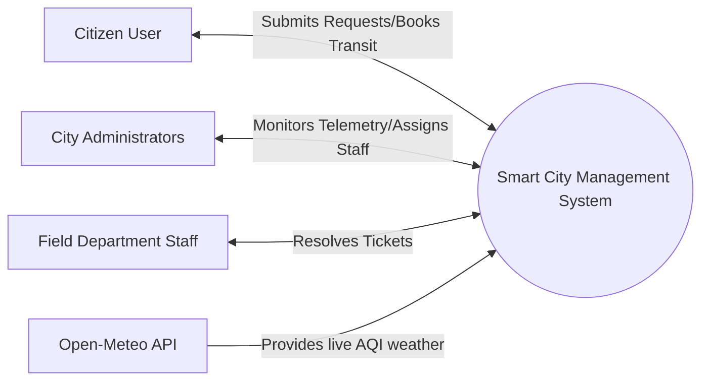

# Smart City Management System

## Overview
The **Smart City Management System** is a comprehensive, centralized web application aimed at modernizing and enhancing the daily life workflow of citizens in a smart city environment (e.g., Mohali). The project digitizes essential municipal operations to ensure efficient administration, seamless citizen engagement, and transparent governance. 

By unifying various public sectors under one unified portal, citizens can seamlessly submit grievances, track E-Governance applications, book transit, vote on community budgets, and receive real-time notifications about the environment and local announcements.

---

## Key Modules & Features
1. **E-Governance & Centralized Grievance Redressal**
   - Citizens can submit Complaints, E-Gov Applications, and Infrastructure requests.
   - Includes document and evidence upload capabilities.
   - Route-based ticket assignment to respective municipal departments.
2. **Healthcare & Essential Services Directory**
   - Live inventory tracking for hospitals (Beds, Blood Bank stats).
   - Interactive directory mapping essential services like fire stations, police, and schools.
3. **Smart Transit & Multi-Modal Booking**
   - Citizens can purchase passes for Bus, Metro, or standard Cab bookings.
   - Fares are dynamically calculated based on selected transport types and distances.
4. **Civic Engagement & Participatory Governance**
   - Publish civic proposal polls (e.g., "Solar Bus Shelters") for citizen voting.
   - Community event tracking with RSVP capabilities to volunteer or attend.
5. **AI-Driven Traffic & Environment Monitor (AQI)**
   - Real-time fetching of Air Quality Index (AQI) from Open-Meteo.
   - Live telemetry dashboard integrating traffic congestion logic based on peak city hours and localized environmental conditions.
6. **Smart Waste & E-Waste Management**
   - Users can raise E-Waste pickup requests mapped via GIS to sanitation departments.

---

## System Development Life Cycle (SDLC) Phases

### 1. Requirement Analysis
The initial phase involved gathering requirements from various municipal stakeholders and citizens. It was identified that cities suffer from fragmented applications (one app for transit, one for complaints, another for hospitals). The core requirement was to unify these under a single **Command & Control** dashboard for both administrators and citizens.

### 2. System Design
- **Architecture**: A Client-Server architecture utilizing a RESTful API pattern.
- **Frontend**: Designed using React.js for a highly responsive, glassmorphism-inspired UI tailored for modern mobile and web interfaces.
- **Backend**: Built with Node.js and Express.js, handling complex routes, authentication, and external API requests.
- **Database Schema (MongoDB)**: Designed scalable collections prioritizing relationships (e.g., embedding User IDs inside Complaints).
- **Real-Time Engine**: Mapped out Socket.io event channels (`new_complaint`, `aqi_update`) for real-time telemetry updates on the dashboard.

### 3. Implementation
The active development phase involved coding the MERN stack. 
- Integrated JWT (JSON Web Tokens) for role-based access control (Admin vs. Department Head vs. Field Staff vs. Citizen).
- Developed backend controllers for managing transit modes, live hospital statistics, and intelligent traffic/AQI calculations.
- Polished the front end to feature robust micro-animations and intuitive civic budgeting poll interfaces.

### 4. Testing
- **Unit Testing**: Validated backend logic such as fare calculation logic in `CabBooking` and the time-based congestion algorithms in `AqiData`.
- **Integration Testing**: Ensured Socket.io connections between the Citizen grievance submission form and the Admin Control Center were broadcasting flawlessly.
- **User Acceptance**: Tested the UI flows (e.g., attempting to submit a complaint without selecting a request type to ensure proper validation).

### 5. Deployment and Maintenance
The dual-server environment (`frontend` and `backend`) is containerized/prepared for deployment on modern PaaS providers (e.g., Vercel for frontend, Render/Railway for backend). Future maintenance includes scaling the database for large municipal loads and integrating actual IoT sensors for the AQI feed.

---

## Entity-Relationship (ER) Model Overview
The system relies on a robust NoSQL schema structure. Key relationships include:
- **User**: The central entity. Contains attributes like `role` (user, admin, department, staff). One-to-Many relationship with Complaints, Polls, and Transit Bookings.
- **Complaint**: Inherits the `userId`. Contains attributes like `category`, `requestType`, `priority`, `status`, and `uploadedDocuments`.
- **Service**: Stores geographical and operational metadata for city services. Extended to store real-time attributes like `hospitalStats`.
- **Announcement**: Contains event metadata and an `rsvps` array referencing `User` IDs.
- **CabBooking (Transit)**: Maps a citizen (`userId`) to a `transportType` (Bus/Metro/Cab) with generated fare costs.

---

## Data Flow Diagram (DFD)

### Level 0 DFD (Context Diagram)


### Level 1 DFD (Core Processes)
1. **Authentication Process**: 
   `User -> (1.0 Login System) -> Generates JWT Auth Token -> Validates Role`
2. **Grievance / E-Governance Process**: 
   `Citizen -> Submits Application -> (2.0 Complaint API) -> Saved in DB -> Broadcasts via Socket -> Admin Dash -> Assigned to Dept`
3. **Environment & Traffic Telemetry Process**:
   `Cron Job / Timer -> (3.0 AQI Sync Service) -> Fetches Meteo API -> Merges AI Traffic Data -> Broadcasts via Socket -> Public Dashboards`

---

## Technical Stack
- **Frontend**: React.js, Vite, Axios, Socket.io-client, React-Toastify
- **Backend**: Node.js, Express.js, Socket.io, Mongoose (MongoDB)
- **External Integration**: Open-Meteo REST API (for Weather & Air Quality simulation)

## Running the Project Locally
Ensure you have Node.js and MongoDB installed.
1. Start the Backend:
   ```bash
   cd backend
   npm install
   npm run dev
   ```
2. Start the Frontend:
   ```bash
   cd frontend
   npm install
   npm run dev
   ```
